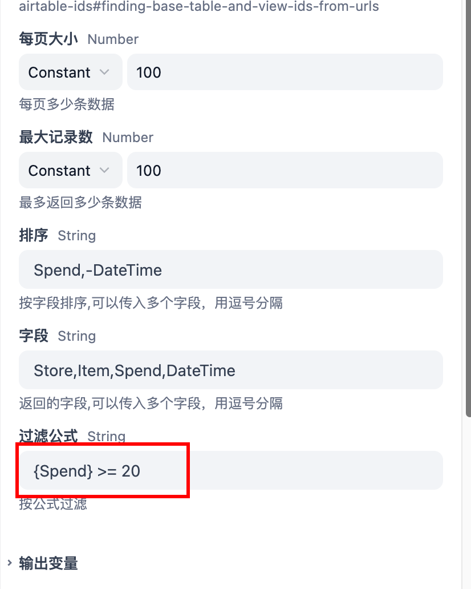
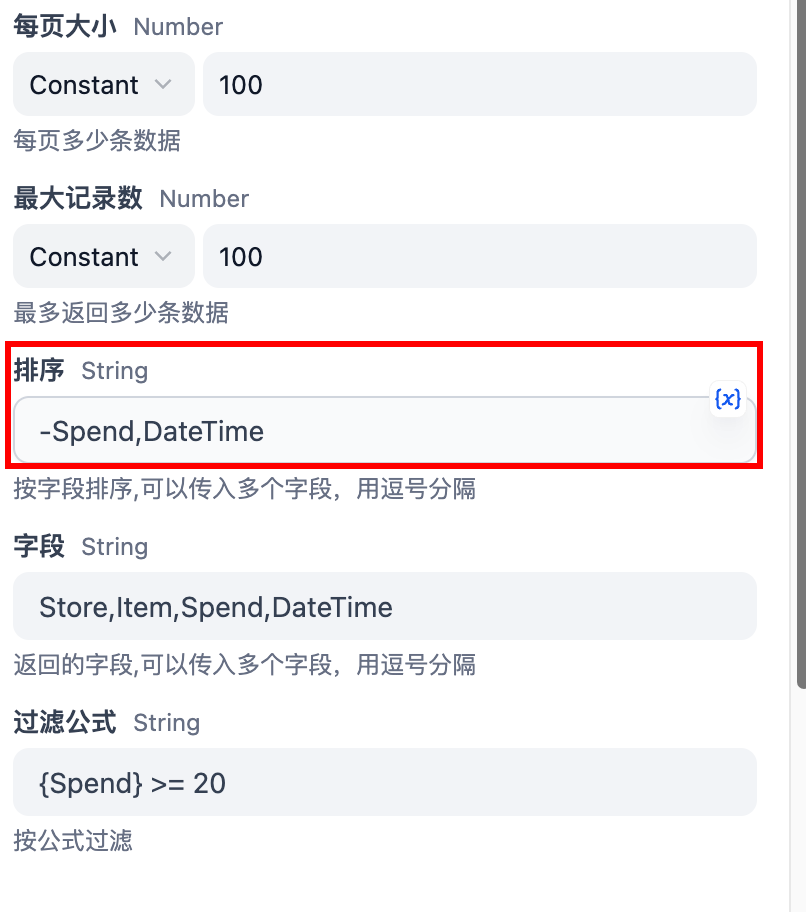
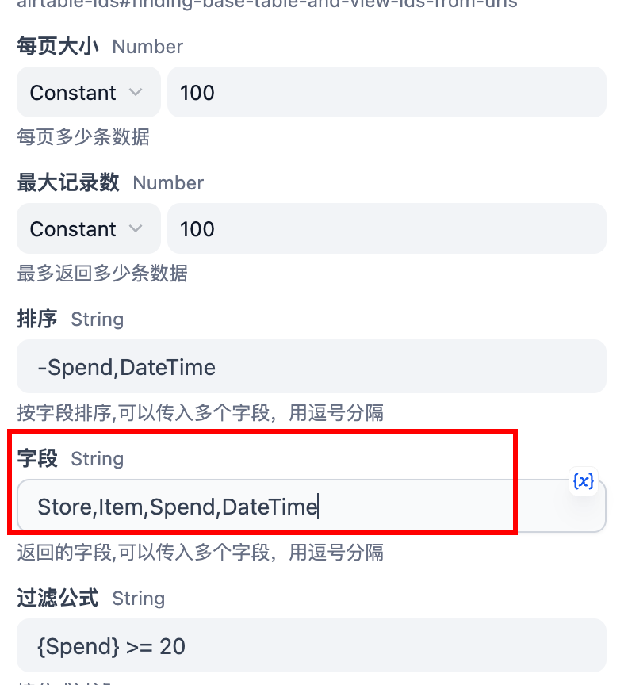

# Airtable Plugin

A plugin tool for operating Airtable, supporting record creation and other operations.

## What's Airtable?

[Airtable](https://airtable.com/) is a cloud-based project management tool that blends a traditional spreadsheet with the robust features of a database. It allows businesses to organize their workflow, data, and records in a flexible and visually appealing way without the need for any coding.
Repository: [dify-airtable-plugin](https://github.com/tokyo2006/dify-airtable-plugin)

## Features

- Support creating records in Airtable
- Support get all records from existing table
- Simple and easy-to-use API interface

## Prerequisites

- Airtable account
- Airtable API Token
- Created Airtable Base and Table

## Configuration Guide

### Getting Required Information

1. **Airtable Token**
   - Visit [Airtable Token Creation Page](https://airtable.com/create/tokens)
   - Create and save your API Token

2. **Base ID and Table ID**
   - Can be obtained from Airtable URL
   - For detailed instructions, refer to: [Finding Airtable IDs](https://support.airtable.com/v1/docs/finding-airtable-ids#finding-base-table-and-view-ids-from-urls)

### Setup Steps

1. Configure Airtable Token
   - Enter your Airtable Token in the plugin configuration
   - Token will be securely stored and used for API authentication

2. Using the Plugin
   - Provide Base ID
   - Provide Table ID
   - Provide record data to create (in JSON format)

## Usage Example

### Create a record

#### Start by creating your own table in Airtable, something like this


Add fields according to your needs

Example of creating a record:

```json
{
  "Spend": 52,
  "Store": "Gas station",
  "Item": "Gas",
  "DateTime": "2025-03-15",
  "Memo": "Filled up 52 yuan worth of gas at the gas station"
}
```

#### Record Retrieval

By providing `baseId` and `tableId` in the tool, you can retrieve records. By default, all records are fetched. The output is returned as text. Example output:

```json
[
  {
    "id": "rec123",
    "Spend": 52,
    "Store": "Gas station",
    "Item": "Gas",
    "DateTime": "2025-03-15",
    "Memo": "Filled up 52 yuan worth of gas at the gas station"
  },
  {
    "id": "rec456",
    "Spend": 100,
    "Store": "Supermarket",
    "Item": "Milk",
    "DateTime": "2025-03-16",
    "Memo": "Bought 100 yuan worth of milk at the supermarket" 
  }
]
```

#### Filtering Records

Use formulas to filter records. For formula syntax, refer to: [Getting Started with Formulas](https://support.airtable.com/v1/docs/getting-started-with-formulas)
Example: To query records with a price equal to or exceeding 20 yuan, use:


Result:

```json
[{"id": "rect1Vk9iOAHPfEk7", "Store": "Starbucks", "Item": "Coffe", "Spend": 20, "DateTime": "2025-03-13T16:00:00.000Z"}, {"id": "recTQXBclb1Fdm4a2", "Item": "Electronic heater", "Spend": 200, "DateTime": "2025-03-15T16:00:00.000Z"}, {"id": "recJUGiFffO6934P9", "Store": "JD", "Item": "SSD", "Spend": 200, "DateTime": "2025-03-15T16:00:00.000Z"}]
```

#### Sorting

Use sort to order records. Supported sorting methods: ASC and DESC. Multiple fields can be sorted by separating them with commas. Prefix a field with `-` for descending order.
Example: Sort by Spend (descending) and DateTime (ascending):


Result:

```json
[{"id": "recTQXBclb1Fdm4a2", "Item": "Electronic heater", "Spend": 200, "DateTime": "2025-03-15T16:00:00.000Z"}, {"id": "recJUGiFffO6934P9", "Store": "JD", "Item": "SSD", "Spend": 200, "DateTime": "2025-03-15T16:00:00.000Z"}, {"id": "rect1Vk9iOAHPfEk7", "Store": "Starbucks", "Item": "Coffe", "Spend": 20, "DateTime": "2025-03-13T16:00:00.000Z"}]
```

#### Returning Specific Fields

Use fields to specify returned fields. Multiple fields are comma-separated.
Example: Return Store, Item, Spend, and DateTime:



Result:

```json
[{"id": "recTQXBclb1Fdm4a2", "Item": "Electronic heater", "Spend": 200, "DateTime": "2025-03-15T16:00:00.000Z"}, {"id": "recJUGiFffO6934P9", "Store": "JD", "Item": "SSD", "Spend": 200, "DateTime": "2025-03-15T16:00:00.000Z"}, {"id": "rect1Vk9iOAHPfEk7", "Store": "Starbucks", "Item": "Coffe", "Spend": 20, "DateTime": "2025-03-13T16:00:00.000Z"}]
```
