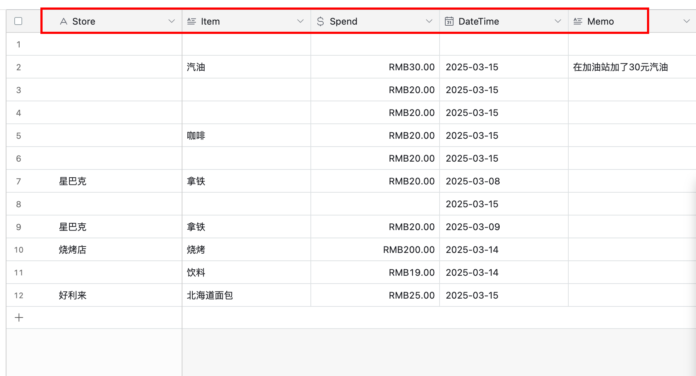

# Airtable Plugin

这是一个用于操作Airtable的插件工具，支持在Airtable中创建记录等操作。

## 什么是Airtable?

[Airtable](https://airtable.com/)是一个基于云的项目管理工具，它将传统的电子表格与数据库的强大功能结合在一起。它允许企业以灵活且具有视觉吸引力的方式组织其工作流、数据和记录，而无需编写任何代码。

## 功能特点

- 支持在Airtable中创建记录
- 简单易用的API接口

## 前置要求

- Airtable账号
- Airtable API Token
- 已创建的Airtable Base和Table

## 配置说明

### 获取必要信息

1. **Airtable Token**
   - 访问 [Airtable Token创建页面](https://airtable.com/create/tokens)
   - 创建并保存您的API Token

2. **Base ID 和 Table ID**
   - 可以从Airtable的URL中获取
   - 详细说明请参考：[Finding Airtable IDs](https://support.airtable.com/v1/docs/finding-airtable-ids#finding-base-table-and-view-ids-from-urls)

### 配置步骤

1. 配置Airtable Token
   - 在插件配置中填入您的Airtable Token
   - Token将被安全存储并用于API认证

2. 使用插件
   - 提供Base ID
   - 提供Table ID
   - 提供要创建的记录数据（JSON格式）

## 使用示例

### 首先在Airtable中创建一个自己的表格，类似这样的



并按照自己的需求添加好字段

### 创建记录示例

```json
{
  "Spend": 52,
  "Store": "加油站",
  "Item": "汽油",
  "DateTime": "2025-03-15",
  "Memo": "在加油站加了52元的汽油"
}
```