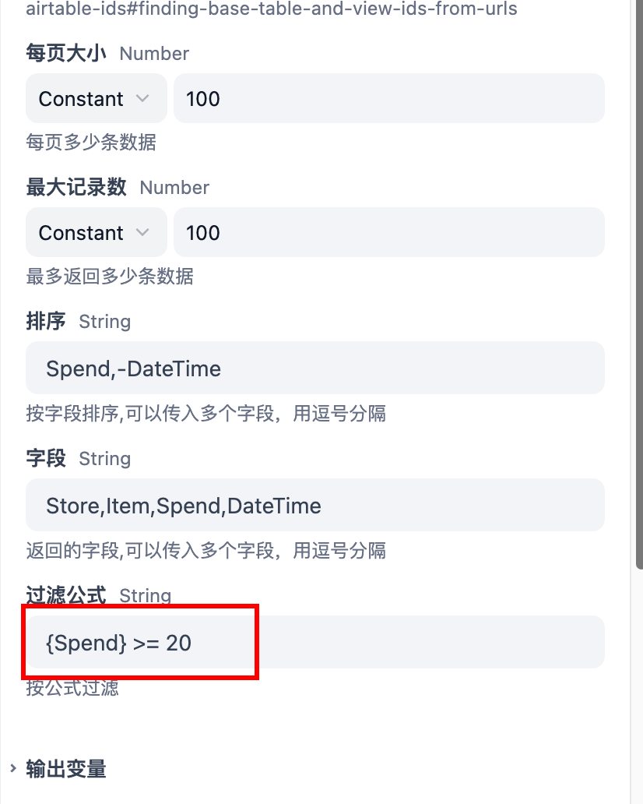

# Airtable Plugin

这是一个用于操作Airtable的插件工具，支持在Airtable中创建记录等操作。
仓库地址是：[dify-airtable-plugin](https://github.com/tokyo2006/dify-airtable-plugin)

## 什么是Airtable?

[Airtable](https://airtable.com/)是一个基于云的项目管理工具，它将传统的电子表格与数据库的强大功能结合在一起。它允许企业以灵活且具有视觉吸引力的方式组织其工作流、数据和记录，而无需编写任何代码。

## 功能特点

- 支持在Airtable中创建记录
- 支持从现有表中获取所有记录
- 支持设置公式来筛选记录
- 支持设置获取需要的字段返回记录
- 支持设置排序方式
- 支持设置返回记录的数量
- 简单易用的API接口

## 前置要求

- Airtable账号
- Airtable API Token
- 已创建的Airtable Base和Table

## 配置说明

### 获取必要信息

1. **Airtable Token**
   - 访问 [Airtable Token创建页面](https://airtable.com/create/tokens)
   - 创建并保存您的API Token

2. **Base ID 和 Table ID**
   - 可以从Airtable的URL中获取
   - 详细说明请参考：[Finding Airtable IDs](https://support.airtable.com/v1/docs/finding-airtable-ids#finding-base-table-and-view-ids-from-urls)

### 配置步骤

1. 配置Airtable Token
   - 在插件配置中填入您的Airtable Token
   - Token将被安全存储并用于API认证

2. 使用插件
   - 提供Base ID
   - 提供Table ID
   - 提供要创建的记录数据（JSON格式）

## 使用示例

### 创建记录

#### 首先在Airtable中创建一个自己的表格，类似这样的


并按照自己的需求添加好字段

### 创建记录示例

```json
{
  "Spend": 52,
  "Store": "加油站",
  "Item": "汽油",
  "DateTime": "2025-03-15",
  "Memo": "在加油站加了52元的汽油"
}
```

#### 获取记录

只要在工具里面提供baseId和tableId，就可以获取记录了，默认是获取所有记录。

输出的结果以文本输出，以下是输出例子:

```json
[
  {
    "id": "rec123",
    "Spend": 52,
    "Store": "Gas station",
    "Item": "Gas",
    "DateTime": "2025-03-15",
    "Memo": "Filled up 52 yuan worth of gas at the gas station"
  },
  {
    "id": "rec456",
    "Spend": 100,
    "Store": "Supermarket",
    "Item": "Milk",
    "DateTime": "2025-03-16",
    "Memo": "Bought 100 yuan worth of milk at the supermarket" 
  }
]
```

#### 筛选记录

  可以使用公式来筛选记录，公式的语法可以参考：[Getting Started with Formulas](https://support.airtable.com/v1/docs/getting-started-with-formulas)

举一个例子，希望查询价格等于或者超过20元的记录，可以这样写：

返回的结果是:

```json
[{"id": "rect1Vk9iOAHPfEk7", "Store": "Starbucks", "Item": "Coffe", "Spend": 20, "DateTime": "2025-03-13T16:00:00.000Z"}, {"id": "recTQXBclb1Fdm4a2", "Item": "Electronic heater", "Spend": 200, "DateTime": "2025-03-15T16:00:00.000Z"}, {"id": "recJUGiFffO6934P9", "Store": "JD", "Item": "SSD", "Spend": 200, "DateTime": "2025-03-15T16:00:00.000Z"}]
```

#### 排序

可以使用sort来排序记录，支持ASC和DESC两种排序方式。支持根据多个字段进行排序，每个字段之间用逗号分隔。降序是在字段前加上-号。
举一个例子，希望按照Spend字段降序排序，并按照时间升序可以这样写：


返回结果是：

```json
[{"id": "recTQXBclb1Fdm4a2", "Item": "Electronic heater", "Spend": 200, "DateTime": "2025-03-15T16:00:00.000Z"}, {"id": "recJUGiFffO6934P9", "Store": "JD", "Item": "SSD", "Spend": 200, "DateTime": "2025-03-15T16:00:00.000Z"}, {"id": "rect1Vk9iOAHPfEk7", "Store": "Starbucks", "Item": "Coffe", "Spend": 20, "DateTime": "2025-03-13T16:00:00.000Z"}]
```

#### 返回需要的字段

可以使用fields来返回需要的字段，支持多个字段，每个字段之间用逗号分隔。
举一个例子，希望返回Store,Item,Spend,DateTime字段，可以这样写：


返回结果是：

```json
[{"id": "recTQXBclb1Fdm4a2", "Item": "Electronic heater", "Spend": 200, "DateTime": "2025-03-15T16:00:00.000Z"}, {"id": "recJUGiFffO6934P9", "Store": "JD", "Item": "SSD", "Spend": 200, "DateTime": "2025-03-15T16:00:00.000Z"}, {"id": "rect1Vk9iOAHPfEk7", "Store": "Starbucks", "Item": "Coffe", "Spend": 20, "DateTime": "2025-03-13T16:00:00.000Z"}]
```
